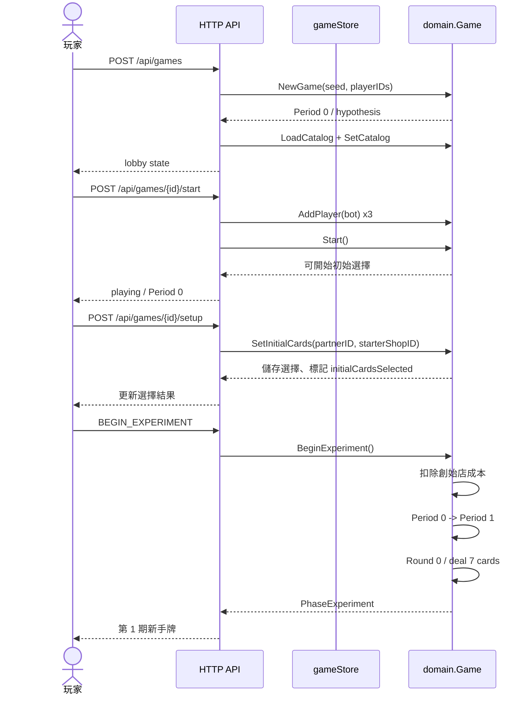
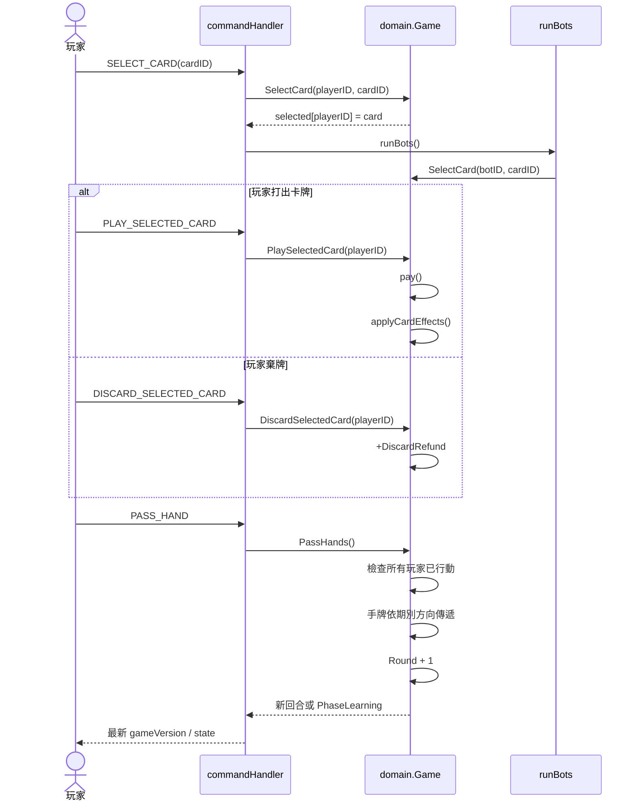
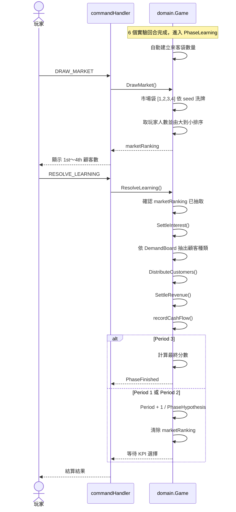
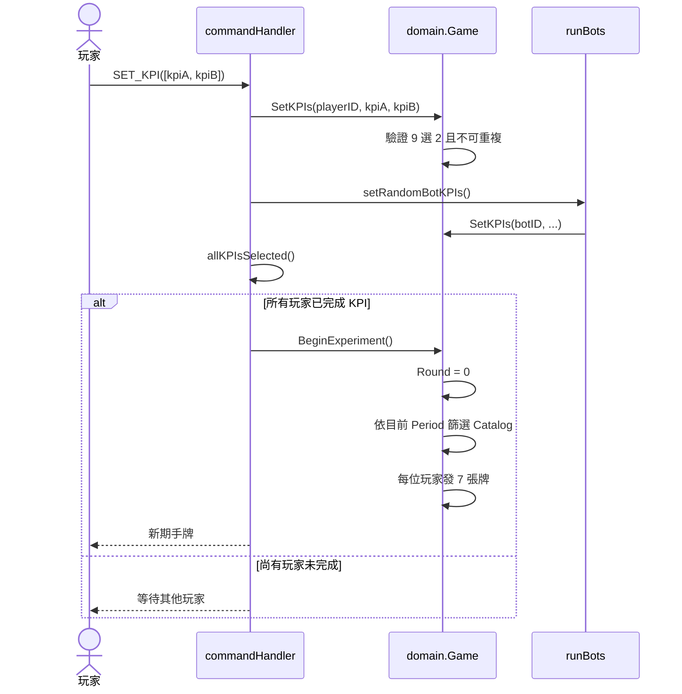

# Cafe Startups 後端時序圖

本文件對應目前 Go 後端的 API 與 `internal/domain.Game` 流程。時序圖使用 Mermaid，可在支援 Mermaid 的 Markdown 預覽器中查看。

## 1. 建立遊戲與 Period 0 初始設定



## 2. 一個實驗回合



## 3. 期末市場抽取與正式結算



## 4. 下一期 KPI 與發牌



## 5. API 與 domain 對照

| API command | Domain method | 主要狀態變更 |
|---|---|---|
| `BEGIN_EXPERIMENT` | `BeginExperiment()` | 進入實驗、設定 Round 0、發牌 |
| `SET_KPI` | `SetKPIs()` | 儲存本期兩個計分指標 |
| `SELECT_CARD` | `SelectCard()` | 記錄玩家選牌 |
| `PLAY_SELECTED_CARD` | `PlaySelectedCard()` | 扣款、放入 Tableau、套用卡牌效果 |
| `DISCARD_SELECTED_CARD` | `DiscardSelectedCard()` | 棄牌並取得補貼 |
| `PASS_HAND` | `PassHands()` | 傳牌、增加 Round、進入 learning 時自動建立來客袋 |
| `DRAW_MARKET` | `DrawMarket()` | 抽取並保存市場排名顧客數 |
| `RESOLVE_LEARNING` | `ResolveLearning()` | 利息、顧客、營收、現金流與換期 |
| `TAKE_LOAN` | `TakeLoan()` | 增加貸款與現金 |

## 6. 重要狀態轉移

```text
Period 0 / hypothesis
  -> BEGIN_EXPERIMENT
Period 1 / experiment / round 0..6
  -> DRAW_MARKET
Period 1 / learning / marketRanking ready
  -> RESOLVE_LEARNING
Period 2 / hypothesis
  -> SET_KPI (all players)
Period 2 / experiment / round 0..6
  -> ...
Period 3 / learning
  -> RESOLVE_LEARNING
finished
```
